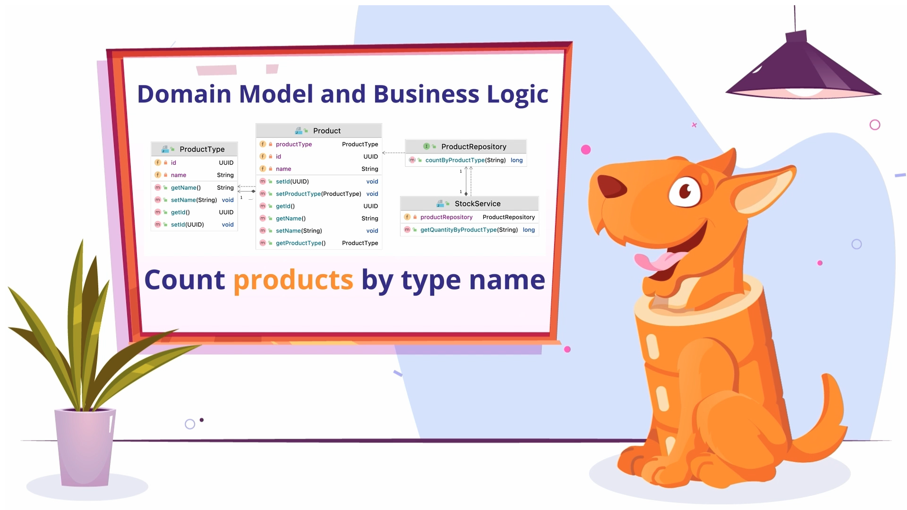

[](https://confluence.jetbrains.com/display/ALL/JetBrains+on+GitHub)

# Writing Integration Tests in Spring Boot App with JPA using JUnit5, Testcontainers and JPA Buddy

You can see the complete guide on how we created the whole project in this repository in the [following video](https://youtu.be/F9UZuRsAW_o):

<div align="center">
  <a href="https://www.youtube.com/watch?v=F9UZuRsAW_o"></a>
</div>

## Basics

This repository contains the stock management application with [Spring Boot](https://spring.io/projects/spring-boot), [Spring Data JPA](https://spring.io/projects/spring-data), and [PostgreSQL](https://www.postgresql.org/).

## Data Model

The application data model consists of two entities: `Product` and `ProductType`. `Product` refers to `ProductType` as many-to-one. 

And the business logic of the app consists of `ProductRepository` that fetches the data from database and `StockService` with one method that calculates the number of products of a particular type. The last one is just invoking the repository to return the result.



## Dependencies

To write a test that checks if the service method returns the correct value, we used Spring Boot Starter for [JUnit5](https://junit.org/) and [Testcontainers](https://www.testcontainers.org/) for our PostgreSQL database.

```xml
<dependency>
    <groupId>org.springframework.boot</groupId>
    <artifactId>spring-boot-starter-test</artifactId>
    <scope>test</scope>
</dependency>
<dependency>
	<groupId>org.testcontainers</groupId>
	<artifactId>testcontainers</artifactId>
	<version>1.18.0</version>
	<scope>test</scope>
</dependency>
<dependency>
	<groupId>org.testcontainers</groupId>
	<artifactId>junit-jupiter</artifactId>
	<version>1.18.0</version>
	<scope>test</scope>
</dependency>
<dependency>
	<groupId>org.testcontainers</groupId>
	<artifactId>postgresql</artifactId>
	<version>1.18.0</version>
	<scope>test</scope>
</dependency>
```

## Preparing Testing Environment

In the `application-test.properties` file, we added the following property to make testcontainers create a PostgreSQL database instance for us.

```properties
spring.datasource.url=jdbc:tc:postgresql:alpine:///shop
```

And in the test class, we specified that we need to use this and not the standard `application.properties` file for tests with the help of `@TestPropertySource` annotation.

To initialize the schema and test data for all tests, we created `schema.sql` and `data.sql` files and placed them in the standard root classpath location. Along with `spring.sql.init.mode property` set to `always`, we tell to Spring Boot use exactly them.

And to make sure that our model is compatible with tables in the database, we set `spring.jpa.hibernate.ddl-auto` property to `validate`.

With the help of `@Sql` annotation, we can define test data only for the particular test and clean it up after execution to avoid interference with other tests. We use different values for the `executionPhase` parameter to achieve it for insert and delete scripts.

The other properties are used for better debugging.

## The results

```java
@SpringBootTest
@TestPropertySource(locations = "classpath:application-test.properties")
public class StockManagementApplicationTests {

    @Autowired
    private StockService stockService;

    @Test
    void contextLoads(){
    }

    @Test
    @Sql(scripts = "insert-products.sql", executionPhase = Sql.ExecutionPhase.BEFORE_TEST_METHOD)
    @Sql(scripts = "delete-products.sql", executionPhase = Sql.ExecutionPhase.AFTER_TEST_METHOD)
    void quantityByProductTypeTest() {
        assertThat(stockService.getQuantityByProductType("Perfume")).isEqualTo(3L);
    }
}
```

Don't forget to run [Docker](https://www.docker.com/) on your machine before starting tests; otherwise, Testcontainers will not create an instance of the database.

